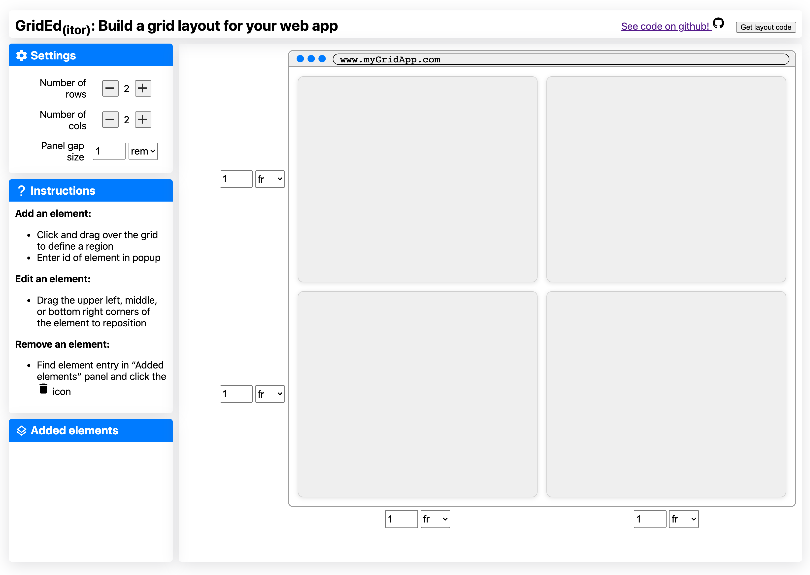

## Summary

Grided is an app that lets you define CSS-Grid layouts in a simple GUI allowing you to see how your app will look while you define it. The app is hosted at [nickstrayer.me/grided](https://nickstrayer.me/grided/) and [the source is on github.](https://github.com/nstrayer/grided)

## Background
I have recently started a job at RStudio on the Shiny team. One of the things that I was brought on to do is "help Shiny user's build more beautiful apps." Because of this I have been working on a project allowing users to layout dashboard apps easily with the [CSS-Grid specification.](https://css-tricks.com/snippets/css/complete-guide-grid/) CSS-Grid is a super powerful way of naturally declaring layouts but if you're like me, the initial setup of getting your app going can be a bit cumbersome. Because of this I almost always reach for a tool like [Sarah Drasner's CSS grid generator](https://cssgrid-generator.netlify.app/) and [grid.layoutit](https://grid.layoutit.com/). 

Inspired by both of these resources, I began working on a similar tool that can let Shiny user's draw their desired layout and then get the code for that layout. After working on this project for a while, however, I realized that what I had built had a few features that I found useful compared to existing tools so I decided to spin off a purely JS/CSS version.  

## Goal

The goal of Grided is to simplify the very first part of building a grid-layout. You specify using a (hopefully) straightforward GUI how you want your app laid out and you get code to implement the structure you defined.

## Usage

The page starts with an empty grid layout. From here you can adjust the number of rows and columns along with the gap between those rows and columns. As you do this the faux app on the right updates in real time. Each column and row can be resized by a control form. `r tufte::margin_note("A fun hidden feature is that when you use the pixel-sizing a drag interface appears for resizing.")` For instance you can have a fixed-width sidebar.

Once you have your desired grid, you add your elements by clicking and dragging them on the grid. Once you have placed an element you provide its ID. Messed up where you placed it? Just drag it around with the supplied interaction handles to move it.  `r tufte::margin_note("A little dashed box shows you the extent of your drag, while the element snaps to the grid.")`

Decide you actually want a footer on your page after declaring a bunch of other stuff? No worries, simply add another row, your elements will stay where they are. Decide you don't want a footer? Just remove a a row. If elements reside in the deleted row/column you will be asked how you want to update them in a popup. 

Happy with your layout and ready to get building your site? Click the "Get code" button in the top right and you will be provided the CSS and HTML code necessary to recreate your layout on your site. 

`r tufte::margin_note("For the Shiny users, the main version of the app will give you R/Shiny code instead of CSS and HTML.")`

## Tech-Specs

There are a few fun facts about the app:

- Zero dependencies. The app is all just vanilla javascript and CSS. It even uses system fonts. The result: the whole app is only  47.5kb.
- Written in [typescript.](https://www.typescriptlang.org/) This is my very first typescript project and it worked pretty dang well.
- Fast: After the resources are loaded it takes less than 10ms to completely render app to starting point.

## Limitations

There are a few (to be kind) limitations right now:

- Only a few CSS units are supported. These are `fr`, `rem`, and `px`. CSS-Grid has some cool fancy options like `minmax()` but I couldn't figure out how to build an interface like this for these dynamic layouts. `r tufte::margin_note("If you can think of one, let me know!")`
- No nested grids. There's no reason in grid you cant but a grid-in-a-grid. My lame cop-out here is to just build your other grid-layout with the app and nest the html within the parent-layout's exported code.
- No mobile mode: If you want to change the layout for your app on mobile you basically have to build it twice and then use media queries (or the more gridy options like `repeat(autofit,...)`). 

